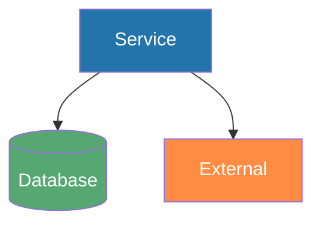

# Design Doc — Engineering Design Document Generator

Generate complete, publication-ready design documents with embedded Mermaid diagrams from a single prompt.

## Philosophy

- **One-shot output** — Full document from single prompt
- **Diagrams first-class** — Every doc includes 2-5 Mermaid diagrams
- **Opinionated defaults** — Make reasonable choices, document in Decision Log

---

## Workflow

1. **Parse request** — Extract what, why, who, constraints, scope
2. **Clarify only if critical** — ONE round of ≤4 questions if truly vague
3. **Select diagrams** — Use decision matrix below
4. **Generate document** — Use template, all sections substantive
5. **Save** — `.output/design-doc-{topic}-{timestamp}.md`

---

## Diagram Selection Matrix

| Scenario | Diagrams |
|----------|----------|
| New service/microservice | C4 Context, C4 Container, Sequence, ERD |
| Feature in existing system | Component, Sequence, State (if stateful) |
| API design | C4 Context, Sequence, Class, ERD |
| Data pipeline/ETL | Flowchart, C4 Container, ERD |
| Auth/authorization | Sequence, C4 Context, State |
| Event-driven | C4 Container, Sequence, Flowchart |
| Migration/refactor | C4 Container (before+after), Flowchart |

**Always include:** 1 context-level diagram + 1 flow diagram

---

## Document Template

```markdown
# Design Document: {Title}

**Author:** {User}
**Date:** {YYYY-MM-DD}
**Status:** Draft

## 1. Overview
### Problem Statement
### Goals
### Non-Goals

## 2. Architecture
### System Context
```mermaid
{C4 Context}
```
### Container View
```mermaid
{C4 Container}
```

## 3. Component Design
```mermaid
{Component/Class}
```

## 4. Data Model
```mermaid
{ERD}
```

## 5. Key Flows
### Primary Flow
```mermaid
{Sequence}
```

## 6. State Management *(if applicable)*
```mermaid
{State}
```

## 7. API Contracts *(if applicable)*

## 8. Non-Functional Requirements

| Requirement | Target |
|-------------|--------|
| Availability | 99.9% |
| Latency (p99) | <200ms |

## 9. Security Considerations

## 10. Decision Log

| # | Decision | Rationale |
|---|----------|-----------|

## 11. Risks & Mitigations

## 12. Open Questions
```

---

## Diagram Styling


```mermaid
%%{init: {'theme': 'default'}}%%
flowchart TD
    A[Service]:::primary --> B[(Database)]:::secondary
    A --> C[External]:::accent

    classDef primary fill:#2374ab,color:#fff
    classDef secondary fill:#57a773,color:#fff
    classDef accent fill:#ff8c42,color:#fff
```

---

## Quick Commands

| User Says | Action |
|-----------|--------|
| "Design a {system}" | Full design document |
| "Create design doc for {feature}" | Scoped to feature |
| "Architect {system}" | Architecture-focused doc |
| "How should I design {thing}?" | Doc with Decision Log |

---

## Reference

`references/mermaid-syntax.md` — Full syntax for all diagram types
