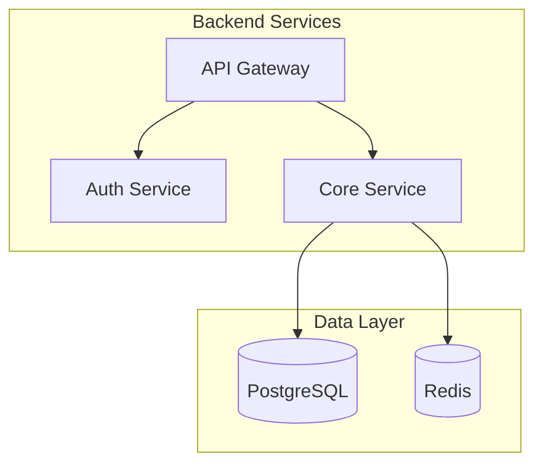
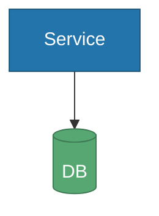
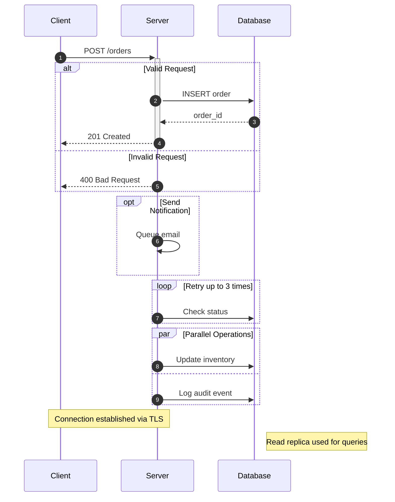
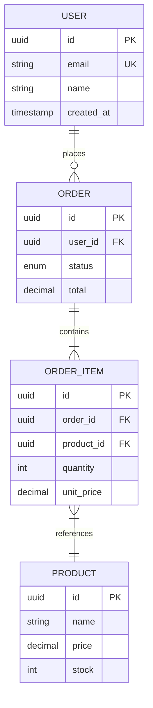
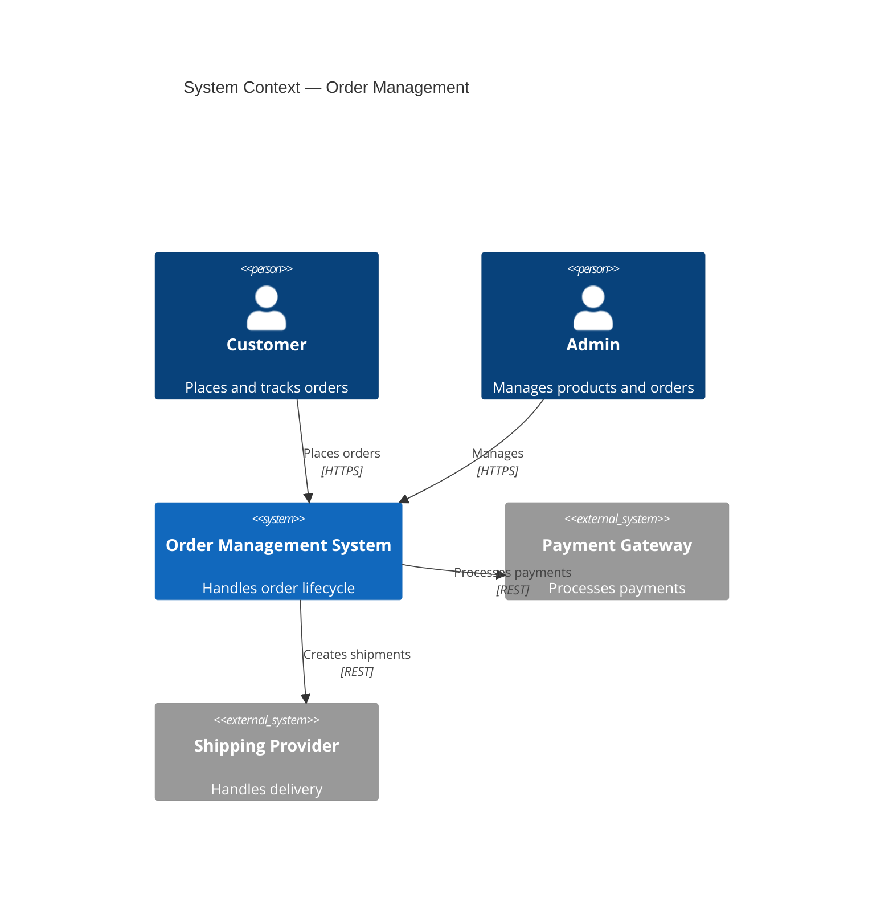
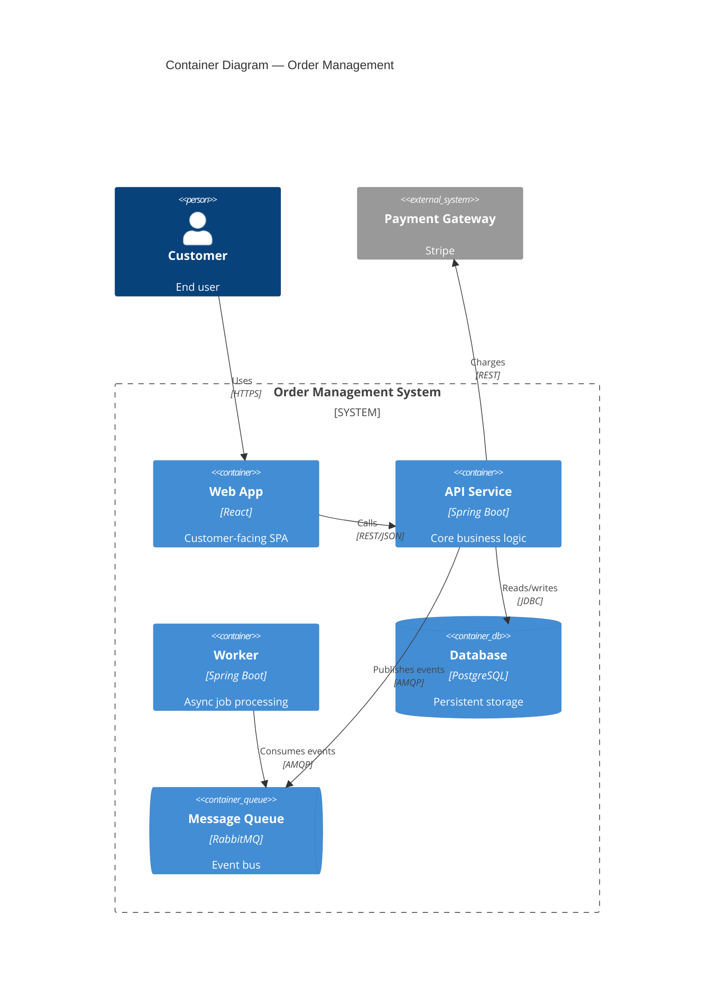
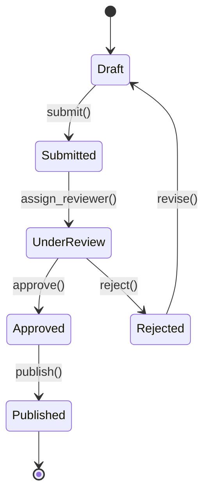
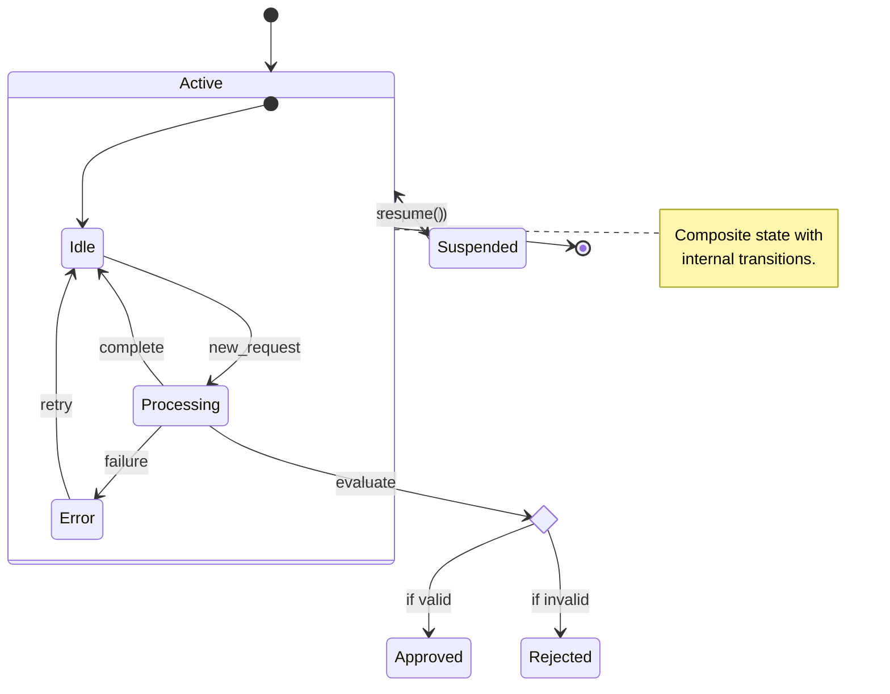
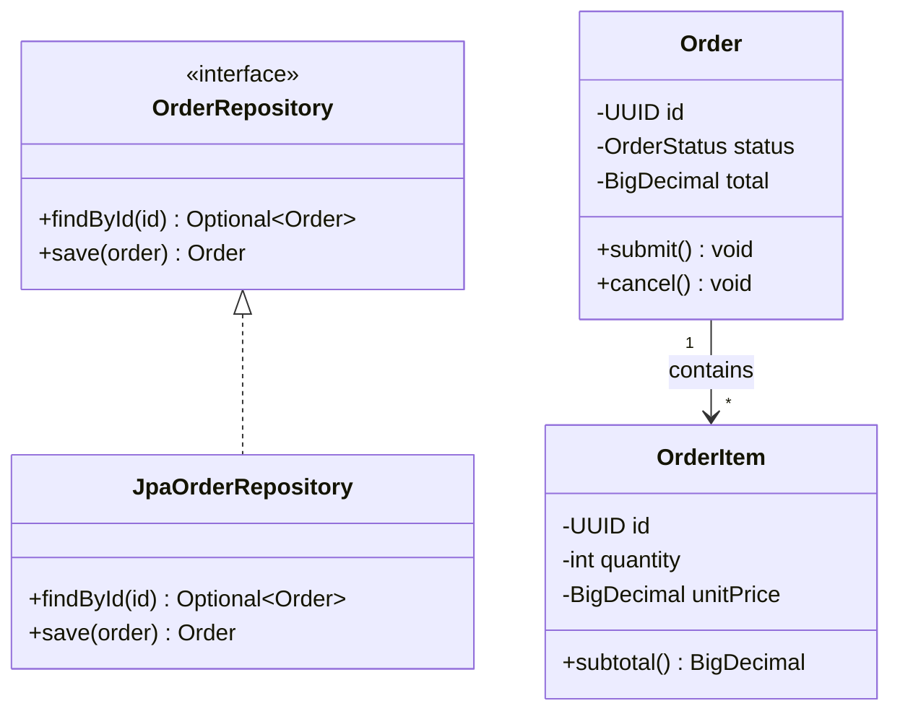
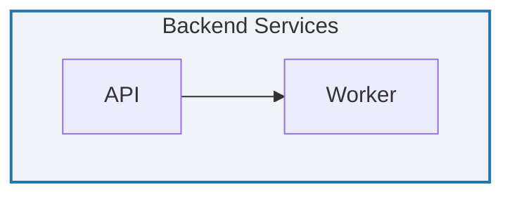

# Mermaid Diagram Syntax Reference

Complete syntax reference for all diagram types used in design documents. Load this file when you need exact syntax for constructing diagrams.

---

## 1. Flowchart

Use for: pipelines, decision trees, process flows, deployment steps.

### Directions

| Direction | Keyword |
|-----------|---------|
| Top to Bottom | `flowchart TD` or `flowchart TB` |
| Left to Right | `flowchart LR` |
| Bottom to Top | `flowchart BT` |
| Right to Left | `flowchart RL` |

### Node Shapes

```mermaid
flowchart TD
    A[Rectangle]           %% Standard process
    B(Rounded)             %% Start/end
    C([Stadium])           %% Terminal
    D[[Subroutine]]        %% Subroutine/subprocess
    E[(Database)]          %% Cylinder — database/storage
    F((Circle))            %% Connector/junction
    G{Diamond}             %% Decision
    H{{Hexagon}}           %% Preparation step
```

### Arrow Types

```mermaid
flowchart LR
    A --> B                %% Solid arrow
    C --- D                %% Solid line (no arrow)
    E -.-> F               %% Dotted arrow
    G ==> H                %% Thick arrow
    I -- "label" --> J     %% Labeled arrow
    K -. "label" .-> L     %% Labeled dotted arrow
```

### Subgraphs



### Styling



---

## 2. Sequence Diagram

Use for: API flows, user journeys, service interactions, authentication flows.

### Participants and Arrow Types

| Arrow | Meaning |
|-------|---------|
| `->>`  | Solid with arrowhead (synchronous request) |
| `-->>`  | Dashed with arrowhead (asynchronous/response) |
| `->`   | Solid without arrowhead |
| `-->`  | Dashed without arrowhead |
| `-x`   | Solid with cross (failed/rejected) |
| `--x`  | Dashed with cross |

### Complete Example (All Control Blocks)



Key features: `autonumber` adds step numbers, `+`/`-` on participants controls activation lifelines, `alt/else/end` for branching, `opt` for optional, `loop` for repetition, `par/and` for parallel, `Note over/right of` for annotations.

---

## 3. Entity Relationship Diagram (ERD)

Use for: data models, database schemas, domain models.

### Relationship Types

| Syntax | Meaning |
|--------|---------|
| `\|\|--\|\|` | One to one |
| `\|\|--o{` | One to zero or more |
| `\|\|--\|{` | One to one or more |
| `o\|--o{` | Zero or one to zero or more |

### Example



### Field Annotations

| Annotation | Meaning |
|------------|---------|
| `PK` | Primary Key |
| `FK` | Foreign Key |
| `UK` | Unique Key |

Supported types: `string`, `int`, `uuid`, `decimal`, `boolean`, `timestamp`, `date`, `text`, `enum`, `json`

---

## 4. C4 Diagrams

Use for: system architecture at different zoom levels.

### C4 Context Diagram

Shows the system in its environment — people and external systems.



### C4 Container Diagram

Shows the deployable units within the system boundary.



### C4 Elements Reference

| Element | Usage |
|---------|-------|
| `Person(alias, label, desc)` | Human actor |
| `System(alias, label, desc)` | Your system |
| `System_Ext(alias, label, desc)` | External system |
| `System_Boundary(alias, label)` | System boundary |
| `Container(alias, label, tech, desc)` | Deployable unit |
| `ContainerDb(alias, label, tech, desc)` | Database container |
| `ContainerQueue(alias, label, tech, desc)` | Message queue container |
| `Container_Boundary(alias, label)` | Container boundary |
| `Component(alias, label, tech, desc)` | Internal component |
| `Rel(from, to, label, tech)` | Relationship |

Use `C4Component` with `Container_Boundary` and `Component()` for component-level diagrams inside a container.

---

## 5. State Diagram

Use for: order lifecycles, workflow states, session management, entity status tracking.

### Basic Syntax



### Advanced Features



Key features: `[*]` for start/end, `state Name { }` for composite states, `<<choice>>` for conditional branching, `<<fork>>`/`<<join>>` for parallel states, `note right of` for annotations, `state "Long Name" as Alias` for aliasing.

---

## 6. Class Diagram

Use for: domain models, service interfaces, DTO structures, component contracts.

### Syntax and Visibility

| Symbol | Meaning |
|--------|---------|
| `+` | Public |
| `-` | Private |
| `#` | Protected |
| `~` | Package/Internal |

### Relationships

| Syntax | Meaning |
|--------|---------|
| `A <\|-- B` | B inherits from A |
| `A *-- B` | A composed of B (strong ownership) |
| `A o-- B` | A aggregates B (weak ownership) |
| `A --> B` | A uses/depends on B |
| `A ..\|> B` | A implements B |
| `A ..> B` | A depends on B (dashed) |

### Example



Annotations: `<<interface>>`, `<<abstract>>`, `<<service>>`, `<<enumeration>>`. Generics: `class ApiResponse~T~`.

---

## 7. Styling Reference

### Themes

```
%%{init: {'theme': 'default'}}%%
```

Available: `default`, `dark`, `forest`, `neutral`, `base`

### Color Palette

| Role | classDef |
|------|----------|
| Primary | `fill:#2374ab,stroke:#1a5276,color:#fff` |
| Secondary | `fill:#57a773,stroke:#3d7a54,color:#fff` |
| Accent | `fill:#ff8c42,stroke:#cc6f35,color:#fff` |
| Error | `fill:#d64045,stroke:#a33033,color:#fff` |
| Neutral | `fill:#e8e8e8,stroke:#bbb,color:#333` |

Apply with: `A[Node]:::primary` and `classDef primary fill:#2374ab,stroke:#1a5276,color:#fff`

### Subgraph Styling



### Tips for Clean Diagrams

1. **Limit nodes** — Keep under 12-15 nodes per diagram. Split if larger.
2. **Consistent direction** — `TD` for hierarchical, `LR` for process flows.
3. **Label all arrows** — Unlabeled arrows are ambiguous.
4. **Use subgraphs** — Group related nodes to reduce visual clutter.
5. **Short labels** — 2-4 words on nodes. Detail in surrounding text.
